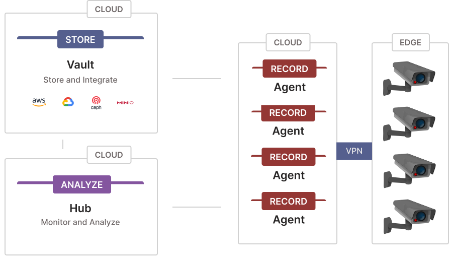

# Kerberos Tunnel

A traditional VMS has hardware at the edge, close to the cameras, to make sure latency is minimal and in case of IP cameras bandwidth is minimal. Within Kerberos.io we apply the same concept with our [Kerberos Agent](https://github.com/kerberos-io/agent), [Kerberos Factory](https://github.com/kerberos-io/factory) and [Kerberos Vault](https://github.com/kerberos-io/vault) solutions.

However on contrary to tradational VMSs we have a cloud native approach, using technologies such as containers, where we have the differentiator to opt for hybrid deployments or full cloud deployments. This means that you can mix components to be deployed at the edge or in the cloud, or the other way around.

In the above scenario you'll see that all components are installed in a remote environment (cloud), which results on no hardware to be installed at the edge (in theory). A VPN network is installed that connects the `edge` network with the `cloud` network, making both look like the same network (also called an [overlay network](https://en.wikipedia.org/wiki/Overlay_network)). To setup an overlay network, there are various tools and libraries such as [`tailscale`](https://tailscale.com/), [`wireguard`](https://www.wireguard.com/), [`netmaker`](https://netmaker.io/) and others.

Once you've setup the overlay network, you will deploy so called [Kerberos Cloud Agents](https://github.com/kerberos-io/agent). These cloud agents, are the same [Kerberos Agents] but then deployed on a remote (outside the edge network) VM, Baremetal or Kubernetes cluster.

## Pros and Cons

Building out a cloud deployment might be appealing as you'll be able to "throw out" the existing (majority) hardware at the edge, making it more lightweight and scalable to deploy. Before you get excited, there are a few more things to consider, and its important to notice that not all is rainbows and butterflies.

Though the deployment model is scalable, as it requires less work to setup an environment, the scale of the deployment and number of cameras is limited by the bandwidth and internet connection. For example it will be unlikely to run a deployment of 200 (Full HD/4K) cameras through a single internet connection.

Pros

- No/limited additional hardware.
- Low maintenance, no replacement of hard disks or other hardware.
- Good option for small sized camera deployments (1-5)

Cons

- No edge recording, when connection goes down, no data.
- Very expensive when scaling out, lots of ingress.
- Not always possible due to network setup.
- No edge processing or buffering.

## Netmaker

As mentioned above their are various options to setup an overlay network, so you might bring your own. As of now we recommend using `wireguard` and more specifically the management layer on top [`netmaker`](https://netmaker.io/).

We will not go in details of how [`netmaker`](https://netmaker.io/) works, please visit their [documentation page](https://docs.netmaker.io/) for more details. Overall it makes setting up an overlay network very straight forward. To give you an idea, once you have setup `the netmaker server`, you are able to onboard new camera
networks (nodes/hosts) in just a few minutes.

### Netmaker server

One of the components you'll need to setup is the Netmaker UI, orchestration layer, which we call the Netmaker server. The server doesn't act as a hub and spoke, but orchestrates the deployment and configuration of nodes in your overlay network.

[Follow the installation guide here](https://netmaker.readthedocs.io/en/master/quick-start.html)

### Netmaker clients

Once you have the server installed, you'll be able to onboard new clients (nodes or peers) in your overlay network. You have various options to onboard a new client: your host system using the netmaker client, a physical router, a docker container, a Kubernetes helm chart, a binary etc.

> !! Please note here that you still need something "physical" in the camera network, but no full blown NVR with expensive harddisk. You might potentially reuse some existing server or small compute !!

[Follow the instructions here](https://netmaker.readthedocs.io/en/master/netclient.html#joining-a-network)

### Netmaker Egresss gateway

Once you have onboarded a new client, you can configure it as an Egress gateway. This means that your client will act as a proxy for your camera network and be responsible for any routing to one or more cameras (data will flow through this component).

[Follow the instructions here](https://netmaker.readthedocs.io/en/master/egress-gateway.html)

## Tutorial Setup an overlay network for Kerberos.io

- TODO, we plan to create a video tutorial.
